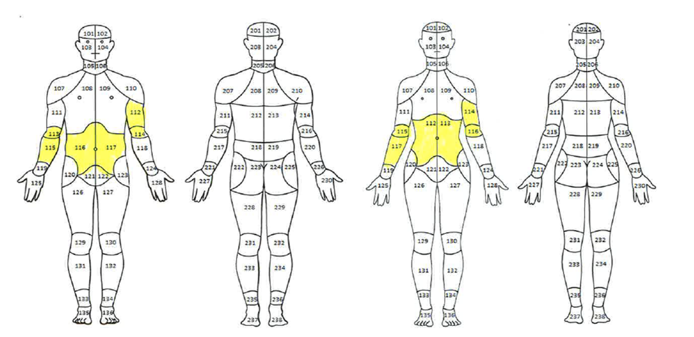

---
output:
  md_document:
    variant: markdown_github
---

<!-- README.md is generated from README.Rmd. Please edit that file -->


# choirtools

The goal of choirtools is to provide a set of tools for cleaning and analyzing data from the Collaborative Health Outcomes Information Registry data base run by the Stanford Pain Clinic. No actual data from the data base is provided in this package. A simulated sample is included for examples and demos.

## To Install `choirtools`

```r
install.packages("devtools")
devtools::install_github("ericscrum/choirtools")
```

## Examples

This is a basic example which shows you how to convert mislabeled female bodymaps to a standard for mixed gender analysis (such as examining differences in segment endorsements between men and women).  

  


```r
## basic example code
# generate example data <- don't do this if you have data already, read it into R with read.delim
GENDER = as.character(c("Male", "Female", "Female"))
BODYMAP_CSV = as.character(c("112,125","112,113","128,117"))
cbind(GENDER, BODYMAP_CSV)
#>      GENDER   BODYMAP_CSV
#> [1,] "Male"   "112,125"  
#> [2,] "Female" "112,113"  
#> [3,] "Female" "128,117"

# convert the female bodymaps to a standard
BODYMAP_CSV[GENDER == "Female"] <- convert_bodymaps(BODYMAP_CSV[GENDER == "Female"])
sampledata <- data.frame(GENDER, BODYMAP_CSV)
sampledata
#>   GENDER BODYMAP_CSV
#> 1   Male     112,125
#> 2 Female     116,117
#> 3 Female     128,115
```

To save your fixed data, run:

```r
write.csv(sampledata, "filepath/filename.csv")
```
